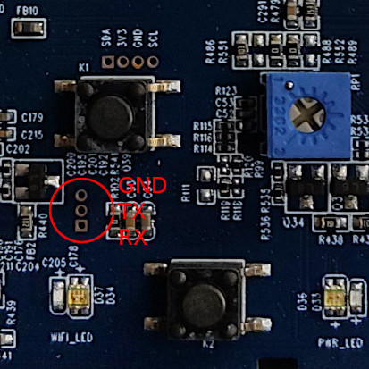

# Install Wibox patch

This guide explains how to install this custom scripts.  
:warning: Please ensure to take additional caution steps and **perform backup** of all the content before writing!

## Serial access

:warning: Do not soldier while the board is plugged. Remove the board from the wall / box.  
It is **highly recommended** to have serial access prepared, as it's your way to recover the board in case something goes wrong.

You can connect to the board via serial port enabled on `ttySGK2`, at baud rate `115200`.
Ensure to **NOT** be using `hardware flow control` in your program, as it blocks input.  

If you don't see any content after booting, enter U-boot settings and run the following:

```
setenv consoledev 'ttySGK0'
saveenv
reset
```

Connectors are smaller than usual (Dupont cable metal contact won't fit),
so you will need to soldier with a copper wire, or just get the copper connector from the Dupont cable.



|Board|TTL|
|-----|---|
|GND  |GND|
|TX   |RX |
|RX   |TX |

## Preparation

- Get access to the Wibox system terminal.  

If your system version is `V500.R001.A103.00.G0021.B007`, you may have access to `telnet` service.  
:warning: New versions such as `V500.R001.A103.00.G021.B013` have this disabled, so you'll need to get **serial access**.

Login to system with user `root` and password `qv2008`.
Don't worry, with this patch you will be able to change the default password. :)

```
IDS79380000 login: root
Password:
#
```

**NOTE:** If console login is from Sofia application, credentials are `root` and `aszeno`.

- Download and build [cramfs-tools](https://github.com/npitre/cramfs-tools).

- Backup all the content before writing.

You can use `ncat` / `nc` command to send data to your computer.

In your Linux computer do:

```sh
for I in $(seq 0 6); do
  ncat -vlp 8888 > mtd${I}
done
```

In your Wibox device do:

```sh
YOUR_COMPUTER_IP=192.168.1.100
for I in $(seq 0 6); do
  dd if=/dev/mtd${I} bs=4096 | nc $YOUR_COMPUTER_IP 8888
  sleep 1
done
```

## Build

Run `sudo make all` to run all the preparation scripts and build your custom image.
Size will be around 4MB and must not exceed 11MB.

Upload the new image to Wibox `/tmp` folder (`ramfs`), you can use `nc` again.

```sh
ncat -vlp 8888 < release/latest
# ----
nc ${YOUR_COMPUTER_IP} 8888 > /tmp/update.img
```

## Flashing

:warning: This step is not fully safe and may require having access to serial to reflash.

Use `update_firmware.sh` script to flash the new firmware placed in `/tmp/update.img`.
This only flashes the `/usr` content folder (`mtd4` partition), so Linux Kernel
will still boot.

After flashing, `reboot` the Wibox device to run the new content.

ℹ️ If you want to flash **manually**, the commands are:

```sh
dd if=/tmp/update.img of=/dev/mtdblock4 bs=4096
# IMPORTANT! ensure changes are written to flash
sync
fsync /dev/mtdblock4
```

## Recovery via Shell

In case the Wibox device does not connect to Wifi back,
chances are that the `/usr` partition is not properly flashed,
and the `run.sh` script is not launching.

The device should launch a `root` terminal via serial port,
so you can continue to manage it.

Recommended to use a laptop and/or having a USB extender
for USB/TTL to the Wibox device.

Use `minicom` to connect to the TTL device and send the file
via serial port using `XMODEM` protocol.

Ensure to setup it first `sudo minicom -s`,
configure default serial device and **disable hardware flow control**.

Once you're connected to the Wibox device via serial:

```sh
cd /tmp
rx /tmp/update.img
```

Then press `[Ctrl]+[a]`, `[z]` and `[s] Send file`.
Send your firmware image and reflash again.
It takes about 20 minutes to send the file.

## Recovery via U-boot

If somehow you're unable to access shell console but U-boot works,
you can also attempt to reflash from there.

:warning: Be sure to read and understand everything you're about to do,
before running any command!

```shell
# Write FF to RAM at address C1000000 (kernel), B10000 times (11MB)
mw.b 0xC1000000 ff 00b10000

# Initialize Flash system
sf probe

# Get content from serial `YMODEM` to RAM. This will take about 15 minutes.
loady 0xC1000000

# As specified in docs/system.md, (/usr) mtd4 size is 11MB.
# Offset / starting address is the sum of the size of previous partitions.
# mtd0 + mtd1 + mtd2 + mtd3 = 0x460000
# 256  + 64   + 1920 + 2240 = 4480KB

# Erase Flash content - empty mtd4
sf erase 0x00460000 00b10000

# Write content from RAM to Flash
sf write 0xC1000000 0x00460000 00b10000

# Reboot device
reset
```
