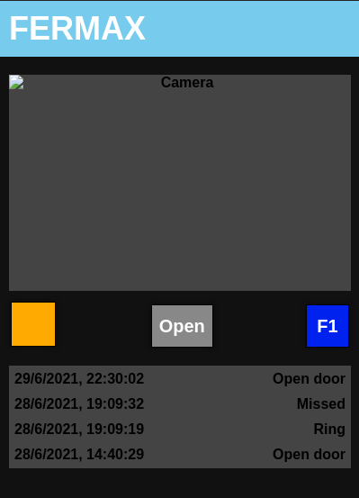
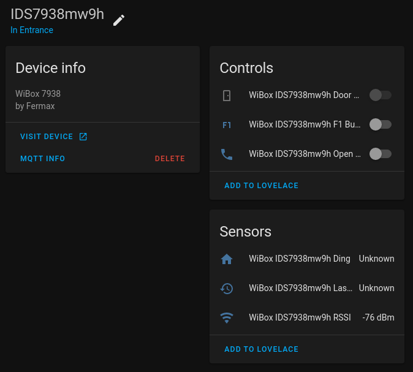

# Using Wibox patch

Once you have successfully installed this patch, you will have access to a
Web UI to control the device, similar as the Android app.

Just access the IP address of the Wibox device (HTTP port 80).



## MQTT / Home Assistant

NOTE: MQTT binaries are still not available.

If you build `mosquitto-client` tools, you can use MQTT to manage the device
via Home Assistant. (tested with plain MQTT port 1883)



Create a file `/mnt/mtd/mqtt.conf` with the following data:

```bash
MQTT_HOST=192.168.10.2
MQTT_USER=mqtt
MQTT_PASS=password
```

## Keep application working

If you want to keep using Sofia original application,
you can tweak `post-run` script in order to boot it.

Beware that enabling Sofia will disable this patched application to work,
so controls will only work with original Wibox application.

Create file `/mnt/mtd/factory` (`touch`) to disable patch boot.

You can also update or create `/mnt/mtd/post.sh` with **executable permissions** and write:

```bash
#!/bin/sh

for NAME in listener listener_mqtt; do
  if [ -e "/tmp/${NAME}.pid" ]; then
    kill `cat /tmp/${NAME}.pid`
  fi
done

for NAME in head mosquitto_sub listener_mqtt.sh; do
killall ${NAME}
done

# run factory program
/usr/run-orig.sh
```
