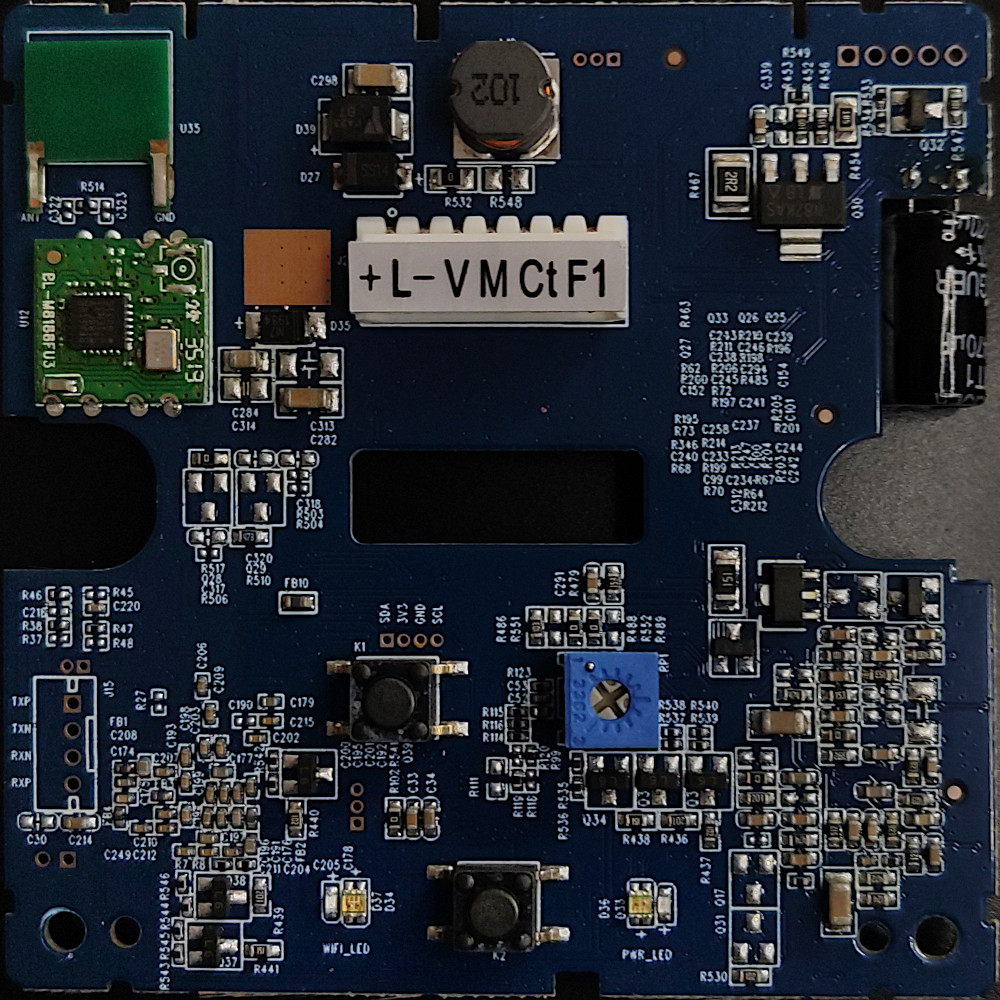
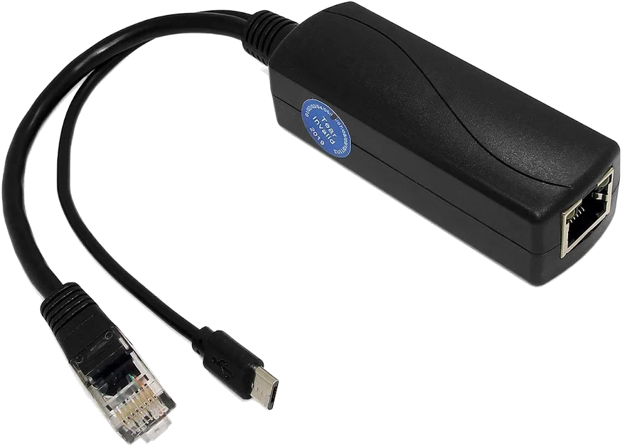
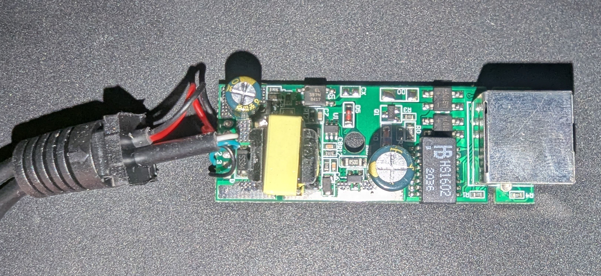
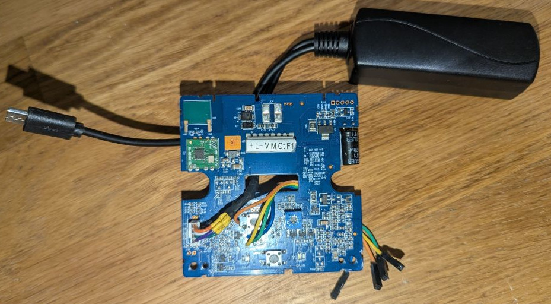

# Hard-wired Ethernet Connection
The Wi-Box's board has an unpopulated header labelled `TXP, TXN, RXP, RXN`. It exposes an un-isolated 100FDX Ethernet interface.



## Ethernet Transformer
Since it appears to go directly to the SOC without protection, an ethernet transformer is **absolutely required** to avoid frying the device when connecting it to your network (think about EMI, lightning, etc.).

To get an ethernet transformer in a user-friendly package, you can use a `IEEE802.3AT PoE splitter`. These isolate the ethernet input with a transformer and:
+ use primary center-taps to extract the common-mode PoE voltage, then feeding the extracted voltage to a DC-DC converter towards the USB connector
+ connecting the secondary of the transformer with the diferential Ethernet data to the output eth cable.



In this case, the `HS1602` is the 100M Eth transformer, but this should be irrelevant.


We don't even need to feed it PoE; the transformer will be in-circuit regardless.

So by stripping the output ethernet cable and connecting it to the board, the `eth0` interface will become up:

### Wiring 
```
eth | board
  1 - TXP
  2 - TXN
  3 - RXP
  6 - RXN
```

> [!NOTE]
> Keep in mind the header is not the ubiquitous 1.27mm pitch but rather 1mm(?), so that may cause some annoyance if you want to add a header connector (comfortable for re-assembling it into the case).



## Default access
The ethernet interface shows up as `eth0` in the device, and is configured by default to use a static IP address of `192.168.1.10`.

> [!NOTE]
> Assign your computer's ethernet NIC connected to the device an IP in the same subnet (e.g. `192.168.1.20`) and subnet mask of at least `/24` so it can communicate with the device.

You can connect it directly to a NIC on your computer a it to any IP in the same subnet, and access it via telnet (if the device is stock).


## Connecting it to an existing network

To connect it to an existing network, you should either set a static IP in your network or enable DHCP:

### Changing the IP address to a static IP
For example, to set the IP address to `192.168.20.133`
```
ip addr add 192.168.20.133/24 dev eth0
ip route add default via 192.168.20.1 dev eth0
```

### Enabling DHCP
TODOa